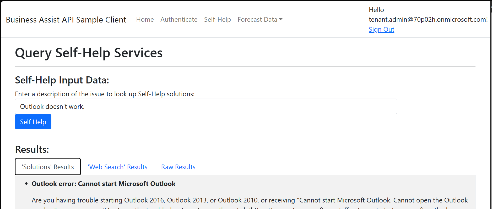

This sample demonstrates how to secure a single-tenant ASP.NET Core MVC web application which calls the Business Assist API with the Microsoft Identity Platform.

## Overview

This sample presents a client Web application that signs-in users and obtains an Access Token for the Business Assist API.

In this sample, the Business Assist Sample Client App is protected with the Microsoft Identity Platform using Azure Active Directory [OAuth 2.0 Bearer Authorization](https://docs.microsoft.com/azure/active-directory/develop/v2-oauth2-auth-code-flow). The BA Sample CLient will support authenticated users with Work and School accounts from the users home tenant. Further on the API will also call a downstream API ([Business Assist API](https://learn.microsoft.com/en-us/microsoft-365/business-assist-api)) **on behalf of the signed-in user** using the [OAuth 2.0 on-behalf-of flow](https://docs.microsoft.com/azure/active-directory/develop/v2-oauth2-on-behalf-of-flow).

The application uses the [Microsoft.Identity.Web](https://aka.ms/microsoft-identity-web) and Microsoft Authentication Library [MSAL.NET](https://github.com/AzureAD/microsoft-authentication-library-for-dotnet) to sign-in user and obtain a JWT access token through the [OAuth 2.0](https://docs.microsoft.com/azure/active-directory/develop/active-directory-protocols-oauth-code) protocol.

The Business Assist API Sample Client App:

1. Signs-in users using the [MSAL.NET](https://github.com/AzureAD/microsoft-authentication-library-for-dotnet) and [Microsoft.Identity.Web](https://github.com/AzureAD/microsoft-identity-web) libraries.
2. Acquires an [Access Token](https://docs.microsoft.com/azure/active-directory/develop/access-tokens) for the Business Assist API.
3. Calls the Business Assist API by using the access token as a bearer token in the authentication header of the Http request.

## Using the Business Assist API Sample Client

To use the Business Assist API Sample Client, complete the following:

1. [Configure the BA API Sample Client](./ReadmeFiles/ReadmeConfigureTheSample.md)
2. [Run the BA API Sample Client](./ReadmeFiles/ReadmeRunTheSample.md)