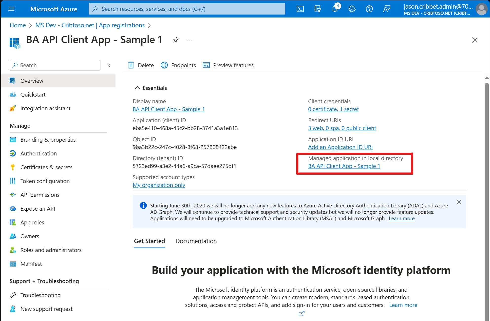

## Register your App in Azure

1. Complete the steps for creating an Azure App Registration for the Business Assist API using the instructions on the Business Assist API https://learn.microsoft.com/en-us/microsoft-365/business-assist-api/get-started/register-with-azure documentation.

- Take note of the following values:
   - Tenant ID
   - Client ID
   - Client Secret

2. Add the following required additional redirect URLs
- Web: https://localhost:44321
- Web: https://localhost:44321/signin-oidc

## Configure the sample

Config File Updates
1. Open appsettings.json
2. Update the following app settings
   - Client Domain
   - Tenant ID
   - Client ID
   - Client Secret
3. Run the Business Assist Client app
4. Open your browser and navigate to `https://localhost:44321`.

### Testing the Application

To properly test this application, you need an Azure AD tenant and *at least* **one** administrator and **one** non-administrator account. To start the testing, you must first provide admin consent for the web application to authenticate to your environment.

### The different ways of obtaining admin consent

A service principal of your single-tenant app is provisioned after the tenant admin manually or programmatically consents. The consent can be obtained from a tenant admin by using one of the following methods:

   1. By using the [/adminconsent](https://docs.microsoft.com/azure/active-directory/develop/v2-admin-consent) endpoint.
   2. By Using the PowerShell command [New-AzADServicePrincipal](https://docs.microsoft.com/powershell/module/Az.Resources/New-AzADServicePrincipal).

#### Obtain Consent using the `/adminconsent` endpoint

You can try the **/adminconsent** endpoint on the home page of the sample by clicking on the `Consent as Admin` link. 


  
Since both the web app and API needs to be consented by the tenant admin, the admin will need to consent twice.

1. First, the tenant admin will consent for the Web API. The Web API is consented first as the client Web app depends on the Web API and not the other way around.
2. Then, the code will redirect the tenant admin to consent for the client web app.

When redirected to the `/adminconsent` endpoint, the tenant admin will see the sign-in or the coose account screen:


After you choose an admin account, it will lead to the following prompt to consent for the **Business Assist API Client App** :


Once it finishes, the service principals for your application will be provisioned in the tenant.

#### Consent using PowerShell

The tenant administrators of a tenant can provision service principals for the applications in their tenant using the AAD PowerShell Module. After installing the AAD PowerShell Module v2, you can run the following cmdlet:

```console
Connect-AzureAD -TenantId "[The tenant Id]"
New-AzureADServicePrincipal -AppId '<client/app id>'
```

If you get errors during admin consent, consider deleting the  **service principal** of your apps in the tenant(s) you are about to test, in order to remove any previously granted consent and to be able to run the **provisioning process** from the beginning.

#### How to delete Service Principals of your apps in a tenant

Steps for deleting a service principal differs with respect to whether the principal is in the **home tenant** of the application or in another tenant. If it is in the **home tenant**, you will find the entry for the application under the **App Registrations** blade. If it is another tenant, you will find the entry under the **Enterprise Applications** blade. Read more about these blades in the [How and why applications are added to Azure AD](https://docs.microsoft.com/azure/active-directory/develop/active-directory-how-applications-are-added).The screenshot below shows how to access the service principal from a **home tenant**:



The rest of the process is the same for both cases. In the next screen, click on **Properties** and then the **Delete** button on the upper side.


You have now deleted the service principal of Business Assist API Web App for that tenant.

## Run the sample

1. Open your browser and navigate to `https://localhost:44321` and sign-in using the link on top-right.
2. After signing in, you can navidate to the Authenticate, Self-Help, and Forecast Data menu items.

For further information on running the sample, visit [Run the Sample](./ReadmeRunTheSample.md).


