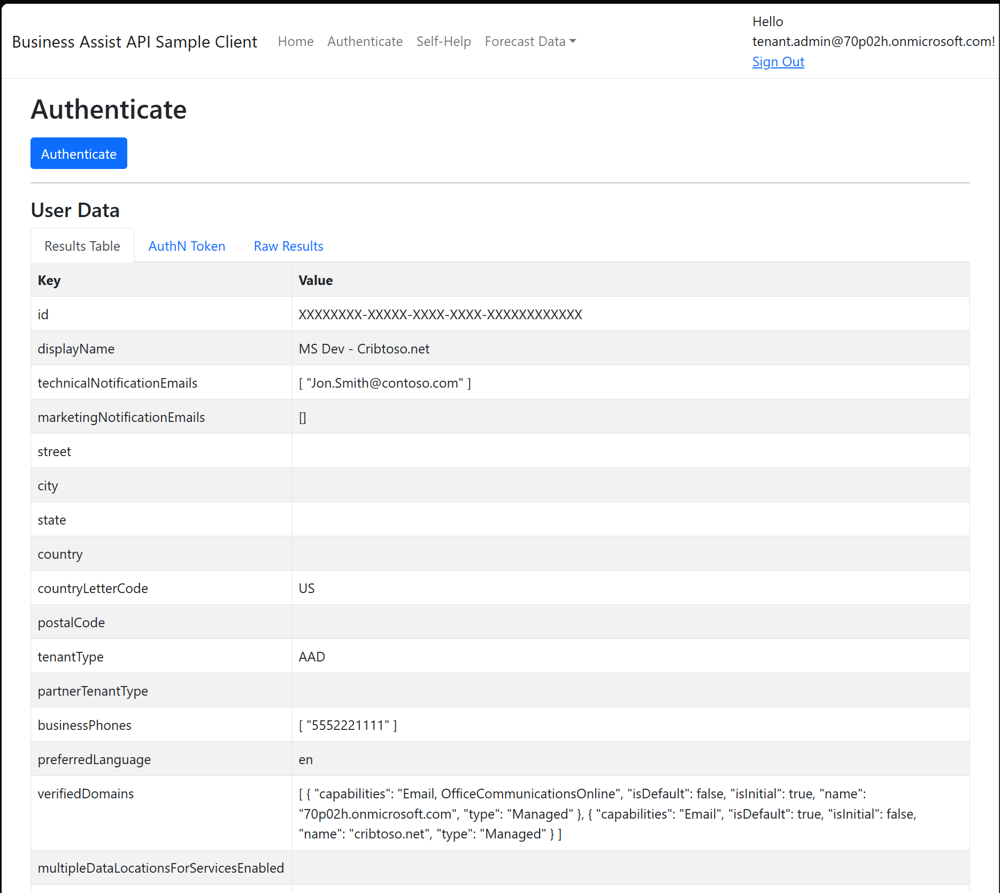
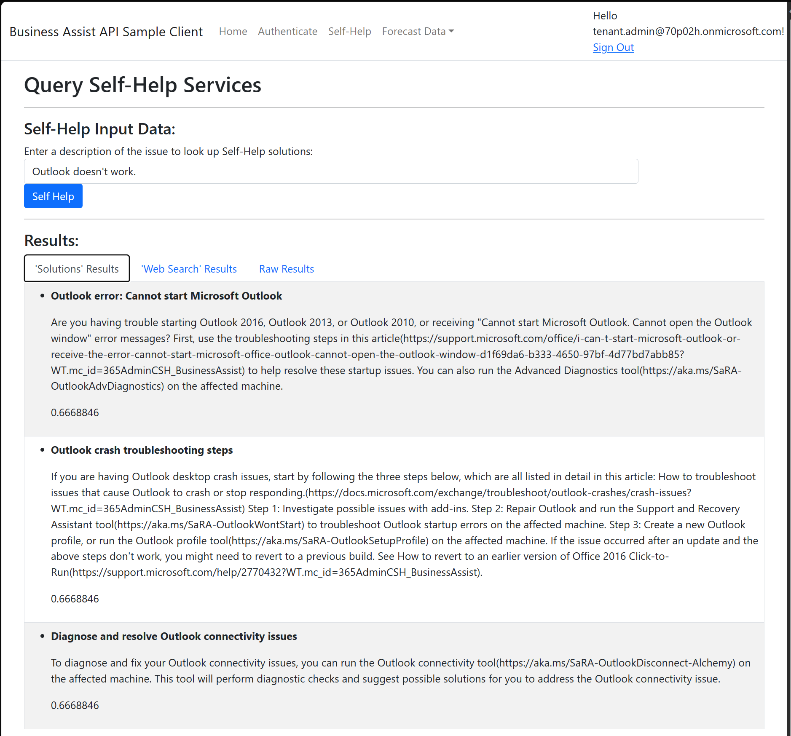
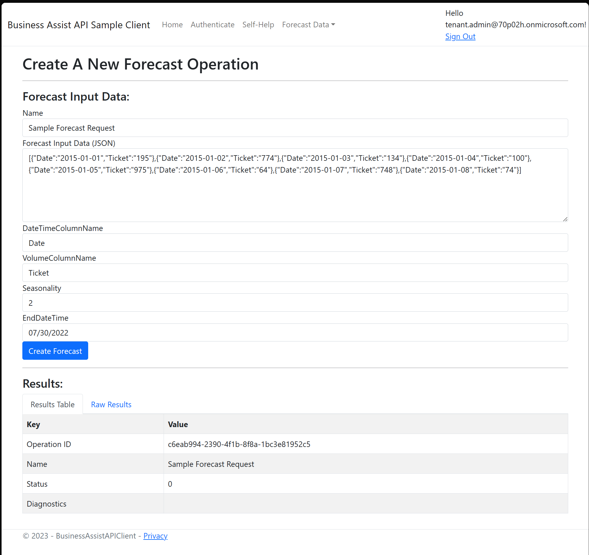
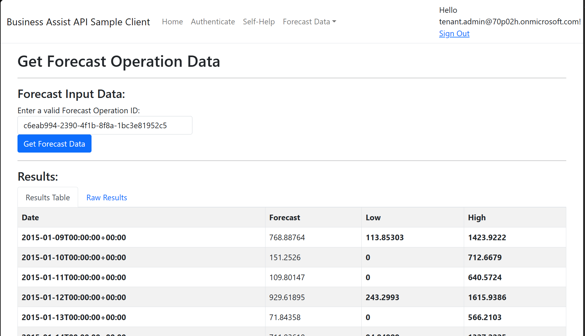

# Run the Business Assist API Sample Client

The Business Assist API Sample Client provides easy access to the Forecast and Self-Help endpoints along with the ability to view and analyze the authentication tokens necessary to use the BA API. The following sections contain details on how to access and use these endpoints.

## Authenticate Page

Navigating to the Authentcate page of the sample will trigger the authentication process for the currently logged in user and generate a 3P App User token that will be used to authenticate and authorize the user to the Business Assist API. After authentication occurs and the token is generated, the Authenticate page will provide details about the token that was generated. This allows you to analyze what claims are requried with the token for use in your own Business Assist App.

> **Reauthentication**
>
> Though the page automatically triggeres the BA API authentication process when renedring the page, you can trigger a reauthentication at any time by clicking the Authenticate button at the top of the page. This will trigger the regeneration of the 3P App User token that is detailed within the page.

### Results Table

This view provides a breakdown of a call to the Microsoft.Graph to gather information related to the currently logged in user. 

### AuthN Token

The AuthN Token tab provides the full encoded token that is generated for the connection to the Business Assist API. The advantage of this view is that you can decode the token using [JWT.ms](https://jwt.ms) to see the claims that are within the token. As shown on the AuthN Token page, the following token claims are essential for the token to authorize with the BA API properly:

- **aud**: Identifies the intended recipient of the token. 
- **tid**: The ID for your Azure tenant.
- **appid**: The Client ID for the Client Azure App Registration that was configured within your Azure tenant.
- **scp**: The set of scopes exposed by your application for which the client application has requested (and received) consent.

### Raw Results

The Raw Results tab provides the raw JSON data that is returned from the auth call that generates the token.

## Self-Help Page

The Self-Help page provides an example of the results that would be received when using the Self-Help capabilities of the Business Assist API. To submit a Self-Help query, simply type description of the issue (e.g. Outlook doesn't work) in the text box and then click the **Self Help** button. The results of the search will be provided in the tabs beneath the search box. 

### 'Solutions' Results Tab

The results of the Self-Help query provides help information that is either from Microsoft's internal 'Solutions' bank of answers or that is a result of a 'Web Search'. The 'Solutions' Results displays the results of the internal solutions bank that relate to the issues queried.

### 'Web Search' Results Tab

The results of the Self-Help query provides help information that is either from Microsoft's internal 'Solutions' bank of answers or that is a result of a 'Web Search'. The 'Web Search' Results displays the results of a web search that relate to the issues queried.

### Raw Results Tab

The Raw Results tab provides the raw JSON response that is received from the call to the BA API Self-Help endpoint.

## Forecast Data Page

The generation of a customer support forecast report is a process that could vary from just a few seconds to multiple minutes depending on the size and complexity of the data being provided. As a result, using the Forecast endpoint of the Business Assist API is a three step process that requires creating the Forecast operation, monitoring the status of the Forecast operation, and retrieving the results of the Forecast operation. The Business Assist API Client provides pages for each of these steps. 

> **Forecast Data Results Tabs**
>
> For each of the steps of the Forecast generation process, the pages contain two results tabs, the Results Table and the Raw Results. The Raw Results tab contains the raw JSON data that is provided as a response to the BA API query. The Results Table tab contains this same information but in a more readable table format.

### Create Forecast Operation Page

The Create Forecast Operation page contains prefilled information related to the initial query for our sample. This data can be modified as needed but is provided in a default state to ensure basic ocnnectiosn to the API. To trigger the creation of a new Forecast Operation, simply enter a unique name in the Name textbox then click the **Create Forecast** button.

Once the forcast operation has been submitted, the BA API will provide an Operation ID which is the ID that is required to complete the forecast status check and to download the results of the operation. **Make a note of this GUID for later use.**

### Get Forecast Operation Status Page

The Get Forecast Operation Status page allows you to monitor the status of the operation as it's being generated. This will provide you with insight into when you are able to download the results of the forecast operation.

To query the status of the forecast operation creation, simply enter the **Operation ID** that you saved from the previous step in the search box and then click the **Get Forecast Status** button.

Within the results tabs of the query, you can see the status of the operation by viewing the **Status** attribute of the results. Once you receive a status value of '2', you are able to query the BA API for the results.

> For more information on the status details for the Forecast service, visit the Business Assist API documentation detailing the [Forecast Status](https://learn.microsoft.com/en-us/microsoft-365/business-assist-api/api-reference/forecast-status) endpoint.

### Get Forecast Operation Data Page

Once the creation of the Forecast operation is complete, you can query the result of the operation from this page. To retrieve the data, simply enter the Operation ID GUID that was saved from the steps above into the search box, then click the **Get Forecast Data** button and the generated forecast data points will be provided in the Results Table.

> For more detailed information on the data that is provided, visit the Business Assist API documentation detailing the [Forecast API](https://learn.microsoft.com/en-us/microsoft-365/business-assist-api/forecast/forecast-overview) service.

